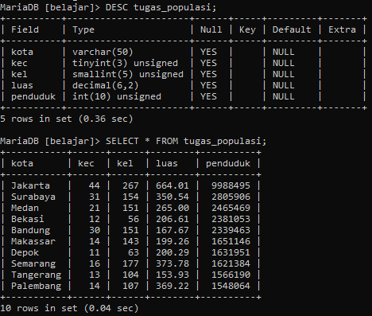
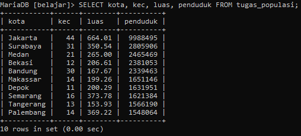
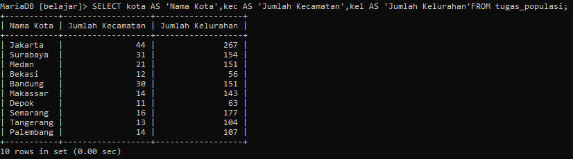
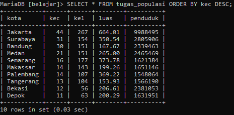
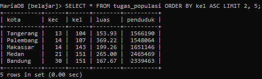
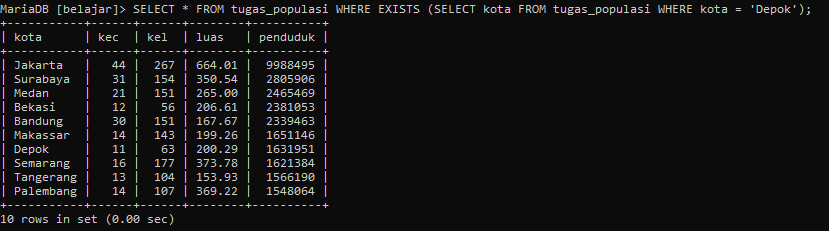
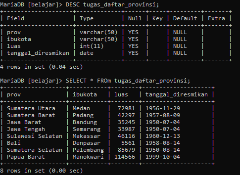
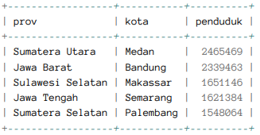
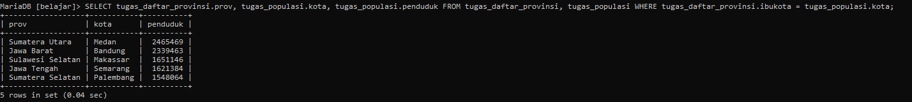
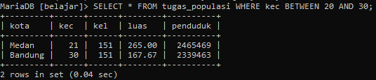

# Tugas_8_MySQL

### Perhatikan gambar dibawah ini!



### Silahkan teman-teman buat table tugas_populasi di dalam database belajar. Struktur serta isi data tabel disamakan dengan gambar diatas.
```mysql
CREATE TABLE tugas_populasi (
	kota VARCHAR(50),
	kec TINYINT UNSIGNED,
	kel SMALLINT UNSIGNED,
	luas DECIMAL(6,2),
	penduduk INTEGER UNSIGNED
);
```

```mysql
INSERT INTO tugas_populasi VALUES
('Jakarta', 44, 267, 664.01, 9988495),
('Surabaya', 31, 154, 350.54, 2805906),
('Medan', 21, 151, 265.00, 2465469),
('Bekasi', 12, 56, 206.61, 2381053),
('Bandung', 30, 151, 167.67, 2339463),
('Makassar', 14, 143, 199.26, 1651146),
('Depok', 11, 63, 200.29, 1631951),
('Semarang', 16, 177, 373.78, 1621384),
('Tangerang', 13, 104, 153.93, 1566190),
('Palembang', 14, 107, 369.22, 1548064);
```

### Jika sudah, silahkan kerjakan tugas berikut:

### 1. Tampilkan kolom kota, kec, luas dan penduduk!
```mysql
SELECT kota, kec, luas, penduduk FROM tugas_populasi;
```



### 2. Tampilkan kolom kota kemudian ubah namanya menjadi Nama Kota, kolom kec menjadi Jumlah Kecamatan dan kolom kel menjadi Jumlah Kelurahan!
```mysql
SELECT 
kota AS 'Nama Kota',
kec AS 'Jumlah Kecamatan',
kel AS 'Jumlah Kelurahan'
FROM tugas_populasi;
```



### 3. Tampilkan data dari table tugas_populasi berdasarkan Kecamatan dari jumlah terbesar!
```mysql
SELECT * FROM tugas_populasi ORDER BY kec DESC;
```



### 4. Urutkan berdasarkan kolom kel lalu diambil 5 data setelah baris ke-2!
```mysql
SELECT * FROM tugas_populasi ORDER BY kel ASC LIMIT 2, 5;
```



### 5. Tampilkan data dimana kolom kota berisi string Depok!
```mysql
SELECT * FROM tugas_populasi WHERE EXISTS (SELECT kota FROM tugas_populasi WHERE kota = 'Depok');
```




### Perhatikan gambar dibawah ini!


### Silahkan teman-teman buat table tugas_daftar_provinsi di dalam database belajar. Struktur serta isi data tabel disamakan dengan gambar diatas.
```mysql
CREATE TABLE tugas_daftar_provinsi (
	prov VARCHAR(50),
	ibukota VARCHAR(50),
	luas INT,
	tanggal_diresmikan DATE
);
```

```mysql
INSERT INTO tugas_daftar_provinsi VALUES
('Sumatera Utara', 'Medan', 72981, '1956-11-29'),
('Sumatera Barat', 'Padang', 42297, '1957-08-09'),
('Jawa Barat', 'Bandung', 35245, '1950-07-04'),
('Jawa Tengah', 'Semarang', 33987, '1950-07-04'),
('Sulawesi Selatan', 'Makassar', 46116, '1960-12-13'),
('Bali', 'Denpasar', 5561, '1958-08-14'),
('Sumatera Selatan', 'Palembang', 85679, '1950-08-14'),
('Papua Barat', 'Manokwari', 114566, '1999-10-04');
```

### Jika sudah, silahkan kerjakan tugas berikut:

### 6. Tuliskan query untuk menampilkan hasil berikut

**Note: Gunakan query SELECT… WHERE table tugas_provinsi = tugas_daftar_provinsi**

```mysql
SELECT tugas_daftar_provinsi.prov, tugas_populasi.kota, tugas_populasi.penduduk 
FROM tugas_daftar_provinsi, tugas_populasi 
WHERE tugas_daftar_provinsi.ibukota = tugas_populasi.kota;
```



### 7. Tampilkan isi tabel populasi dimana nilai kolom kecamatan antara 20 dan 30!
```mysql
SELECT * FROM tugas_populasi WHERE kec BETWEEN 20 AND 30;
```


